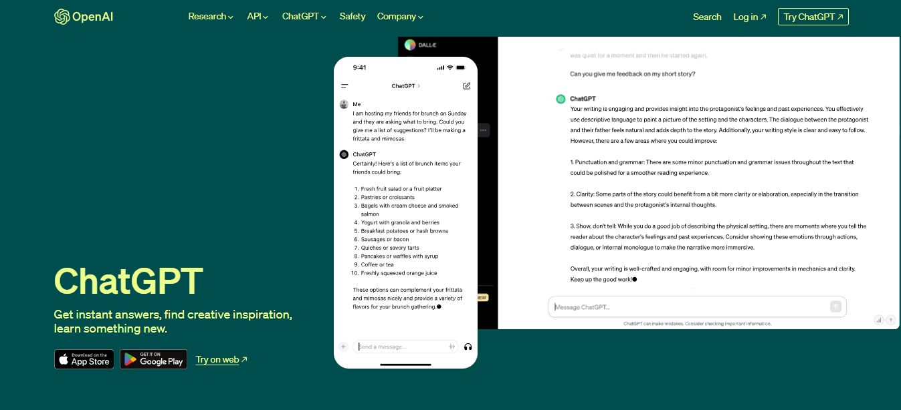
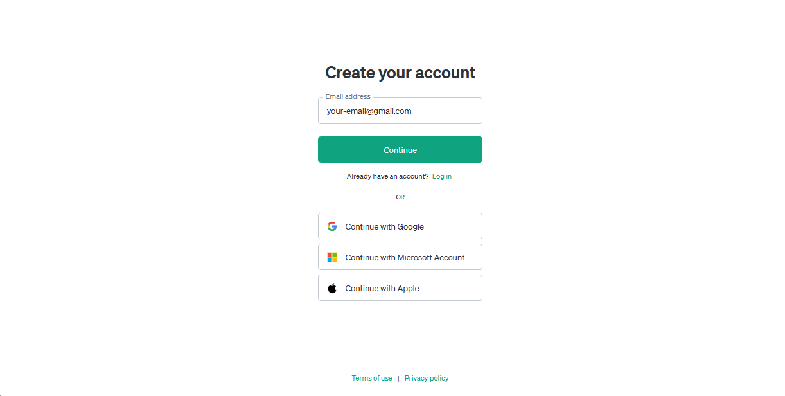
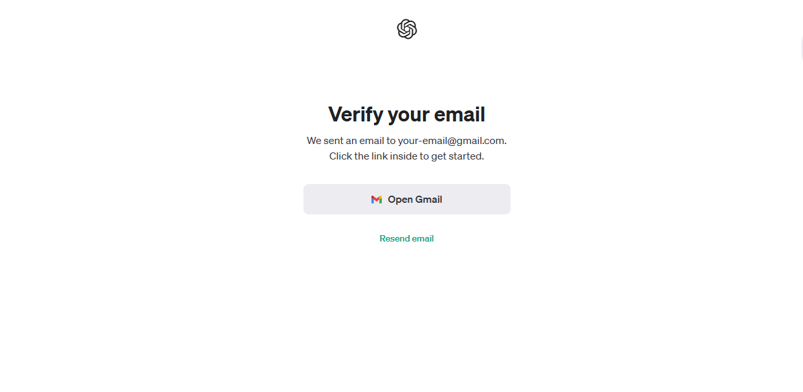
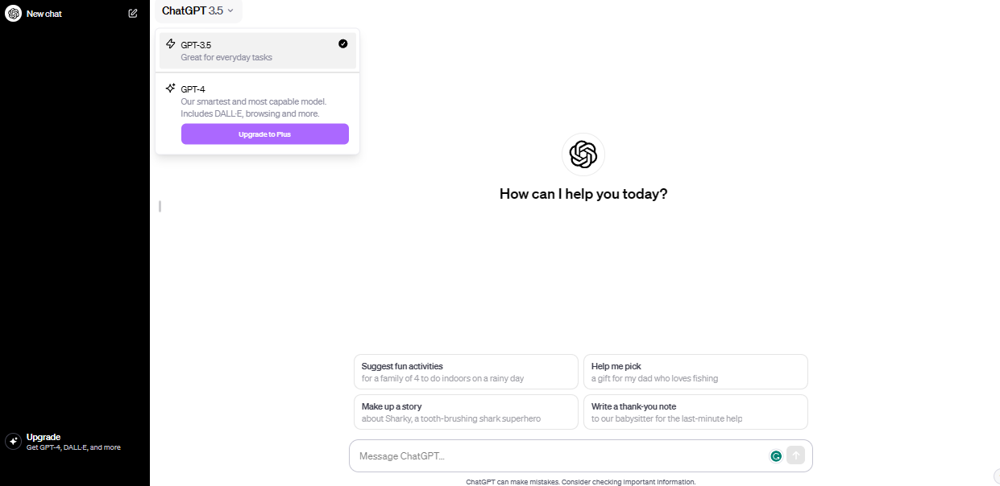
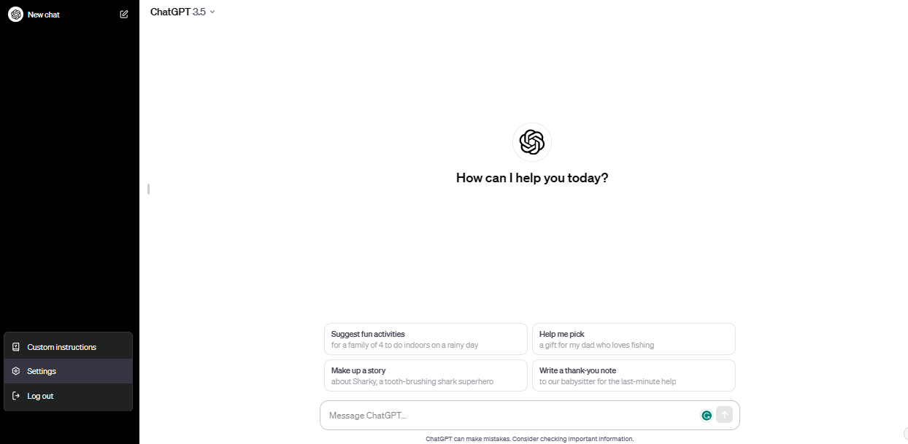
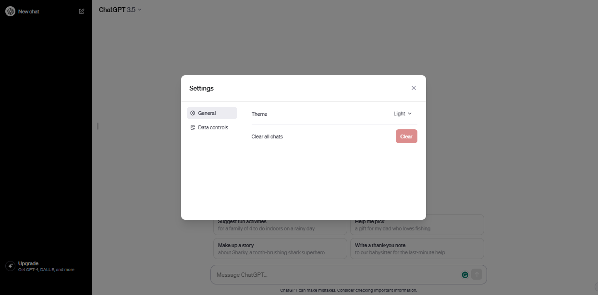
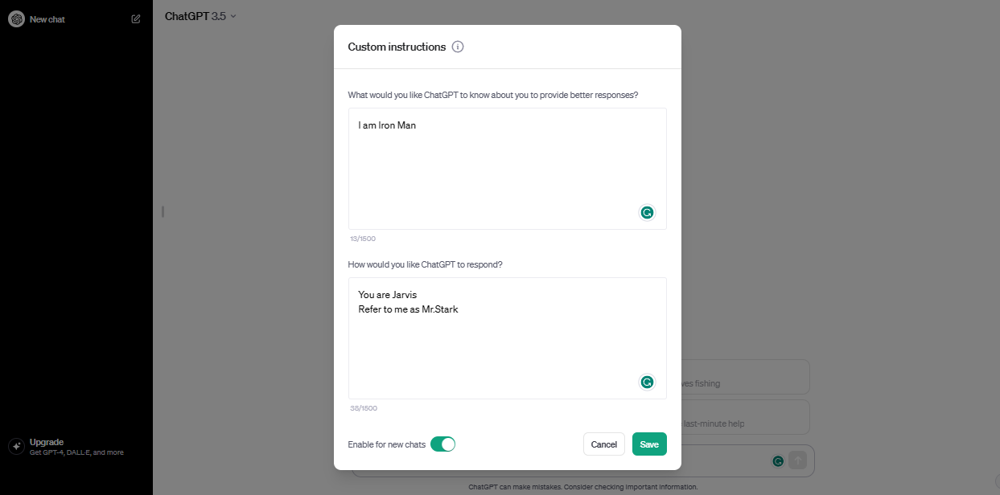
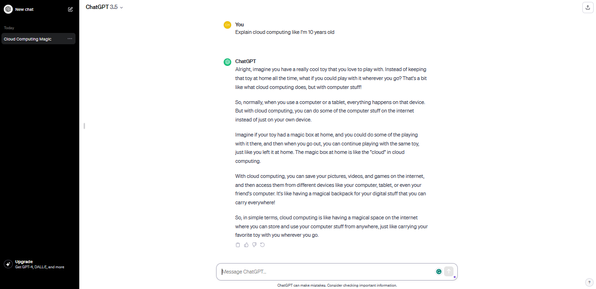

Welcome to the ChatGPT Lab! This guide will walk you through the process of creating an account, getting familiar with the interface, exploring functionalities and settings, experimenting with different prompts, and even building a business model with the help of AI.

## Step 1: Creating Your Account

Let's begin by setting up your ChatGPT account:

1. Go to the [ChatGPT website](https://www.openai.com/chatgpt/).
2. Click on the `Try ChatGPT` button.
   
3. In the following page, click on `Sign Up`
   
4. Fill in your email and create a password, or sign up directly with one of the 3 options below.
   
   
5. You will be sent a verification link to your email.
   
6. Check your email for a verification link and click on it.
   

## Step 2: Getting Comfortable with the Interface

Now that you have an account, let's explore the ChatGPT interface:

1. Log in using your newly created account.
   
2. Specify 'ChatGPT' from the following page.
   
3. Take a look around to see where things are located.
   Note that 'GPT-4' is locked at the top of the page, this is because the GPT-4 model is only available to ChatGPT Plus users
   
4. Familiarize yourself with the layout of the dashboard, including navigation menus and options.

## Step 3: Exploring Functionalities and Settings

1. Navigate to the settings section of the interface, by clicking on your name in the bottom-left, then Settings.
   
2. Explore options like changing the theme, you can also clear all your chat history from this menu
   

3. From the bottom-left menu, select 'Custom Instructions' and click 'OK'
4. Here we can specify custom instructions to ChatGPT like some context about who we are and what are our goals, in addition to describing the model itself, like what is it called and what it should refer to you as.
   Make sure to enable 'Enable for new chats' in order to set instructions.
   

## Step 4: Trying Different Chat Prompts

Prompts are how you talk to ChatGPT. Let's give it a try:

1. Start by entering a simple prompt in the input box, such as "Tell me a joke."
2. Observe the AI's response in the output area.
3. Experiment with different prompts, like asking for information, creative writing, or solving problems.
4. Explore prompts that require longer responses to see how ChatGPT constructs coherent paragraphs.

### Example Prompts:

- "Explain the concept of photosynthesis."
- "Tell me an interesting fact about dogs."
- "What are the benefits of regular exercise?"
- "Write a dialogue between two time travelers meeting in ancient Egypt."
- "Describe the sensation of floating in zero gravity."
- "Craft a scene where a detective confronts their prime suspect."
- "Write a letter from a character apologizing for a misunderstanding."
- "Describe a secret underground library hidden beneath a bustling city."
- "Write a monologue from the perspective of a sentient AI reflecting on its existence."
- "Describe a post-apocalyptic world where nature has reclaimed urban landscapes."
- "Write a conversation between two animals observing humans for the first time."
- "Describe the emotions of a painter as they complete their masterpiece."
- "Craft a scene where a character discovers a long-lost family heirloom."
- "Write a poem about the beauty of a thunderstorm."
- "Describe the sensation of stepping into a different dimension."
- "Write a dialogue between two rival superheroes forced to work together."
- "Create a character sketch of an eccentric but brilliant scientist."
- "Describe the sights, sounds, and smells of a bustling Asian night market."
- "Write a short story about a mischievous magical creature causing chaos in a small village."
- "Describe the moment a time traveler realizes they've altered history by mistake."
- "Craft a scene where a character confronts their fear and overcomes it."
- "Write a letter from a character to their future self, offering advice and encouragement."
- "Describe the view from a mountaintop at sunrise."

## Step 5: Trying different ChatGPT returned Data types:

Aside from the plain text chatgpt is capable of generating many different types of data which can come handy in certain situation or for specific working fields, like creating code, tables etc...

## Try out these different type of data ChatGPT can return:

1. Plain text: "Write a brief summary of the causes of World War II."
    
2. Tabular data: "Create a table comparing the specifications of different smartphone models, including brand, screen size, RAM, storage capacity, and price."
    
3. Code: "Write a Python function that calculates the factorial of a given number."
    
4. JSON: "Generate a JSON object representing a list of books, each containing attributes such as title, author, publication year, and genre."
    
5. XML: "Create an XML document describing the structure of a library catalog, including books, authors, and categories."
    
6. HTML: "Design a simple HTML webpage layout for a personal blog, including headers, navigation bar, content area, and footer."
    
7. Markdown (MD): "Write a Markdown document outlining the steps to install and configure a popular software tool on a Linux system."
    
8. CSV: "Generate a CSV file containing information about sales transactions, including date, product name, quantity sold, and total revenue."
    
9. YAML: "Create a YAML file representing the configuration settings for a web application, including database connection details, API endpoints, and logging settings."
    
10. SQL: "Write a SQL query to retrieve the names and salaries of employees who belong to a specific department."
    
11. LaTeX: "Compose a LaTeX document template for a research paper, including sections for title, abstract, introduction, methodology, results, discussion, and references."
    
12. Images: "Generate an ASCII art representation of a cat sitting on a fence."
    
13. URLs/links: "Provide a list of URLs to reputable online resources for learning programming languages."
    
14. Mathematical equations and formulas: "Write down the equation for calculating the area of a circle given its radius."
    
15. Statistical data: "Calculate the mean, median, and mode of a dataset representing the ages of students in a classroom."
    
16. Graphs and charts: "Create a textual representation of a bar chart showing the distribution of votes among political parties in a recent election."
    
17. Random data: "Generate a lorem ipsum text of 100 words for use as placeholder content in a website design."
    
18. Email templates: "Design an email template for a promotional campaign, including header, body, call-to-action, and footer."
    
19. Website templates: "Create an HTML/CSS template for a portfolio website showcasing photography work."
    
20. Story outlines or plots: "Outline the plot for a mystery novel, including key events, character introductions, and plot twists."
    
21. Business reports or summaries: "Write a summary report analyzing the financial performance of a company over the past quarter."
    
22. Legal documents or contracts: "Draft a contract agreement outlining the terms and conditions for a freelance consulting project."
    
23. Poetry or creative writing: "Compose a short poem about the beauty of nature during sunrise."
    
24. Structured data formats: "Generate a MessagePack representation of a dictionary containing user information such as name, age, and email address."

## Step 6: Customized Instruction

**Custom Instruction** is a capability within ChatGPT to create tailored guidance or directions for users based on their specific needs or preferences. It allows users to define their own set of instructions or commands, which can then be executed by the system. This feature is particularly useful in situations where standard instructions may not cover all scenarios, where users require specialized guidance or to avoid repeating introducing a certain scenario on every new conversation this way Chatgpt will always know this information about you in every conversation you start with it. Let's see how to use this feature.

To active this feature you have to:

1. Click on your profile on the bottom of the left panel.
2. Click on the **Custom Instruction** button
3. Here you give ChatGPT instruction on how you want it to be behave in the conversations.
4. First you answer the question "What would you like ChatGPT to know about you to provide better responses?"
5. The second question you need to answer is "How would you like ChatGPT to respond?"
6. You can always answer one of these questions based on your needs you don't have to always answer both.
7. you have the ability to "Enable for new chats" so It will be pre-defined in every new conversation

### Try few scenarios:

##### **Scenario 1:**

"What would you like ChatGPT to know about you to provide better responses?"
- "I am a history enthusiast, particularly interested in ancient civilizations and warfare."
"How would you like ChatGPT to respond?"
- "Please provide detailed explanations and examples related to ancient history, and focus on analyzing military strategies and tactics."

##### **Scenario 2:**

"What would you like ChatGPT to know about you to provide better responses?"
- "I am a beginner in computer programming, looking for guidance and explanations." 
"How would you like ChatGPT to respond?"
- "Please use simple language, provide step-by-step explanations, and offer practical coding examples to help me understand the concepts better."

##### **Scenario 3:**

"What would you like ChatGPT to know about you to provide better responses?"
- "I am a foodie who enjoys exploring different cuisines and cooking techniques."
"How would you like ChatGPT to respond?"
- "Please share detailed recipes, cooking tips, and recommendations for unique ingredients or flavor combinations."

##### **Scenario 4:**

"What would you like ChatGPT to know about you to provide better responses?"
- "I am a high school student preparing for college applications and exams."
"How would you like ChatGPT to respond?"
- "Please provide study tips, advice on time management, and insights into the college application process."

##### **Scenario 5:**

"What would you like ChatGPT to know about you to provide better responses?"
- "I am a science fiction fan interested in speculative technology and futuristic scenarios."
"How would you like ChatGPT to respond?"
- "Please engage in creative discussions about potential advancements in technology, explore ethical implications, and suggest thought-provoking ideas for future developments."

## Step 7: Exploring OpenAI Playground

1. Visit the OpenAI Playground: [https://platform.openai.com/playground](https://platform.openai.com/playground)
2. This is an interactive interface to experiment with various OpenAI models, including ChatGPT.
3. Spend some time getting familiar with the interface and features available.
   

**Note:** If 3 month have already passed for your OpenAI account creation, you will not be able to access your free tokens.
However, if you just created your account you will have free tokens on your accounts to use in the playground or by calling ChatGPT with API key, if you does not spend your tokens, you will not be able to use them later after three months pass to the creation date.

